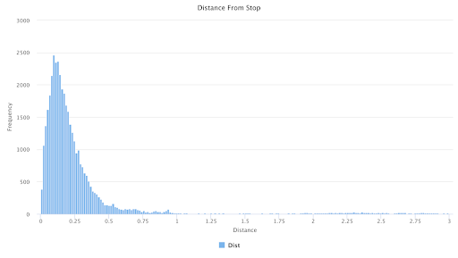
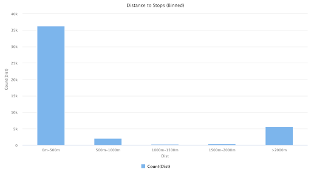
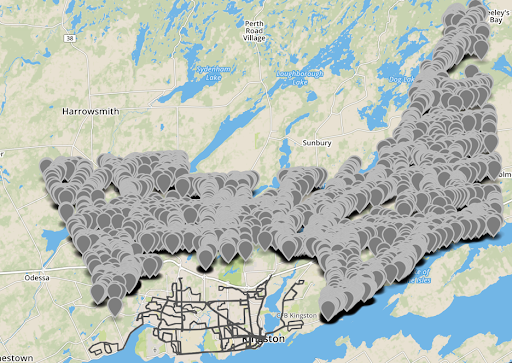
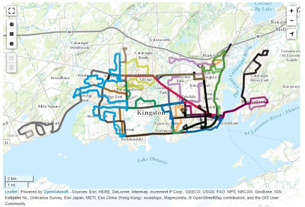
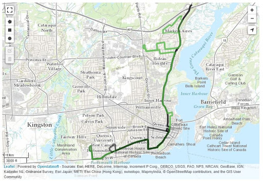
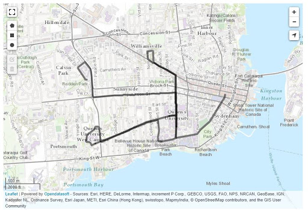
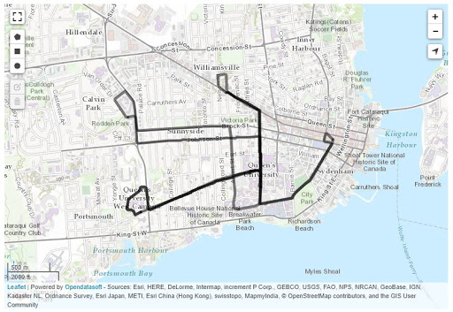

```{r setup, include=FALSE}
knitr::opts_chunk$set(echo = TRUE)
```

```{r map_setup,include = FALSE, echo=FALSE}


library(ggplot2)
library(lubridate)
library(tidyverse)
library(dygraphs)
library(readxl)
library(leaflet)
library(sf)
library(rmapshaper)


tmp <- st_read("data/transit-gtfs-routes.shp")


data.p <- tmp %>%
  st_transform(4326) %>%
  rmapshaper::ms_simplify()

data.p <- data.p[,c("route_id", "route_color", "geometry")]


tmp <- st_read("data/neighbourhood-census-profiles-family-housing-mobility.shp")

data.n <- tmp %>%
  st_transform(4326) %>%
  rmapshaper::ms_simplify()


neighborhod_area <- read.csv("data/neighbourhoods.csv",sep = ';')[,1:4]


data.n <- left_join(data.n,
                    neighborhod_area[,c("Neighbourhood.Identifier","Geographic.Area")],
                    by = c("area_id_num" = "Neighbourhood.Identifier"))

data.n$den <- round(data.n$total_popul/(data.n$Geographic.Area/10^5),2)

data.n <- data.n[,c("community_n", "den", "geometry")]
data.n <- data.n[which(data.n$community_n != "Kingston"),]

# temp <- unite(data.n, col ="Name_density", c("community_n","den"), sep = " : ")
data.n$popup <- paste(data.n$community_n," : ",data.n$den," persons/square km")


lng.center <- -76.55
lat.center <- 44.23283
zoom.def <- 12


```

### We will look at the state of public transit in the Kingston region. Focusling on the accesability and coverage of bus routes, we will answer the following questions:

- Are Kingston bus routes servicing the city effectively?
- Are there areas in need of bus routes? 
- Are there redundant bus routes that can be removed? 

## Where do People Live and Where to Buses Service? 
# A Look at the Coverage of Kingston Bus Routes

```{r map_low_density , echo=FALSE}

pal <- colorNumeric(
  palette = "magma",
  domain = data.n$den)


leaflet(data = data.p) %>%
  addProviderTiles("OpenStreetMap.Mapnik", options = providerTileOptions(opacity = 1), group = "Open Street Map") %>%
  setView(lng = lng.center, lat = lat.center, zoom = zoom.def-1) %>%
  addPolylines(group = 'base',
               fillColor = 'transparent',
               color = "black",
               weight = 3,
               popup = ~route_id) %>%
  addPolygons(data = data.n,
              weight = 1,
              fillColor = ~pal(den), 
              color = "blue",
              group = "base",
              popup = ~popup)


```

We can see that there are neighborhoods with no bus coverage, thouhgh on closer inspection, these areas have a low population density, and are locaated far from the downtown core. It is reasonable to conclude that the people living in these regions do not depend on public transit. Should public transit be expanded to cover these regions, it would be at a very high per person cost. 


## Focus on High Density Areas


```{r map_high_density, echo=FALSE}


# Exclude rural


data.n_no_sparse <- data.n[which(data.n$den >= 50),]

lng.center <- -76.55
lat.center <- 44.23283
zoom.def <- 12

pal_h <- colorNumeric(
  palette = "magma",
  domain = data.n_no_sparse$den)


leaflet(data = data.p) %>%
  addProviderTiles("OpenStreetMap.Mapnik", options = providerTileOptions(opacity = 1), group = "Open Street Map") %>%
  setView(lng = lng.center, lat = lat.center, zoom = zoom.def) %>%
  addPolylines(group = 'base',
               fillColor = 'transparent',
               color = "black",
               weight = 3,
               popup = ~paste("route: ",route_id)) %>%
  addPolygons(data = data.n_no_sparse,
              weight = 1,
              fillColor = ~pal_h(den), 
              color = "blue",
              group = "base",
              popup = ~popup)

```

We can see that in regions with high density, the current buss routes have good coverage.

## Bus Stop – Driveway data
 
One way we can get a sense of whether or not there are enough bus routes for the city of Kingston is that we can analyse the number and positions of bus stops against the positions of driveways. 
 
According to open data Kingston, there are 825 unique stops. The stops were given in longitudinal and latitudinal coordinates.
 
There are 44,651 unique driveways provided in the dataset. As there are over 136,000 people and assuming that each household has 3-4 people (which equates to 45,000 households), and we can say that the number of driveways fair estimate for the number of households in Kingston. 
 
An algorithm was written so that for each driveway coordinate pair, it finds the closest bus stop using the square root of sum of squares method. The new distance attribute is then concatenated with the longitude and latitude of the driveway.



This chart displays the distance from each of the driveways to its closest bus stop. The closest bus stops had a distance of 0.0 km and the furthest was over 26 km. It is interesting to note that a distance of 0 means that the driveway and the stop had the exact same coordinates. However, this may be due to the rounding error introduced by MATLAB or just the inaccuracy of the location data.



By discretizing the different distances, we can get a sense for the general sense for the distribution by categories. According to the Federal Highway Administration, most people are willing to walk for 5-10 minutes to a bus stop (FHWA 2019). This equates to 400 meters to 800 meters from a person’s home to the nearest transit station. For more remote areas, the same report stated that people are willing to walk up to 1400 meters for larger stations such as railway terminals. As seen in the figure above, over 35,000 driveways are less than 500 meters away from a bus stop. This is 80% of the total number of driveways in Kingston. For distances from 500 meters to 1500 meters, there are only around 2300 driveways which accounts for less than 5%. A possible explanation is that there is no underground subway system in Kingston.
 
 
It is also worthwhile to look at the farther distances. There is a total of 5631 driveways that are beyond 2000 meters. In a study done by McGill University (El-Geneidy 2013), a distance of 2000 meters is beyond what people are willing to walk every day and into the range of daily driving distances. If these more distant driveways are still in heavily populated areas, it is a good case to potentially add more bus routes.





Most of the driveway points that are over 2 KM away from the nearest bus stop are North of the Kingston area, more specifically, part of the Southern Frontenac county. This region only has a population density of around 19.2/km2much less than the ~300/km2 of the Kingston region south of the 401. A population density of 300/km2 is recommended for a bus system (Bertaud & Richardson 2005). A population of less than 20 is not enough. Therefore, we can say that we do not need to add routes to these areas.
 
Furthermore, from the figure above, we can see a large number of driveway points are east of Kingston and have direct access to Highway 401, facilitating rapid private transport to and from the Kingston metro area.


## Bus Route – Driveway Data
 
Bus route data obtained from the Kingston database can also be analyzed against driveway data. By doing so, we can determine the distance of each driveway to each route, specifically, which route is the closest for each driveway. This can be done by employing the algorithm developed for the stop – driveway analysis. 


## Redundant Bus Routes – Transit Bus Routes (GTFS-static) data



Using the Transit Bus Routes (GTFS-static) data set available on the Open Data Kingston website, which has 30 different routes, we were able to visualize the routes and look for potential similarities. When examining all of the transit bus routes in Kingston on one map (figure 2.1) it is difficult to establish any clear redundancies. The vast amount of routes make it hard to tell where some routes begin and end. There are even some routes that cannot be seen since they are covered entirely by other routes. To effectively analyze the redundancy of the routes, we compared each route one by one to establish any similarities.


The first grouping of similar routes that we discovered are routes 1, 8, 17D, 801 and 802 (figure 2.2). At first glance it seemed that routes 8, 17D, 801 and 802 make up small segments of route 1. Routes 801 and 



802 are almost identical, which is because the 801 becomes the 802 when it returns southbound, following the northbound route that the 801 takes. Although route 1 passes every stop that the 801 and 802 does, route 1 has significantly more stops. While the bus on route 1 has 46 potential stops to get from just south of the 401 on Montreal Street to the Queen’s University campus, the bus on routes 801 and 802 only have 12. Even though these routes are redundant, having the 801 and 802 serve as express routes along route 1 make for more efficient travel, so they should not be cancelled. In terms of route 17D, the downtown route, it follows a small part of route 1 precisely, apart from two loops it makes at each end of it’s route. This is an important route, even though it is redundant, because of the increase of commuters in the downtown area. Lastly route 8, which follows an exact portion of route 1 exists to help service peak demand in certain areas of the City (primarily, the Union Street corridor between St. Lawrence College and Downtown), so it is clear that we should not remove it. 

The second grouping of similar routes that we discovered are routes 17A, 17D, 17P and 17W. While 17A and 17D seem to form two separate routes (figure 2.31), when you plot 17P and 17W on top of 17A and 17D (figure 2.32) we don’t see much difference from these already established routes. However, it is because they are all one bus that simply changes its number (route) at a certain stop. The 17W becomes the 17D, which becomes the 17P, which becomes the 17A, which becomes the 17A. So instead of their being what looks to be two sets of overlapping routes, in reality it is all one route. Something to note about these routes as well is they are only in operation during the academic year from September to April, so it is evident that they exist to support the increase of student commuters during this time.





	Upon further investigation we see that routes 501-502, 601-602, and 701-702, much like the express routes 801-802 we examined in figure 2.2, are the same routes and the 01 bus in each pair becomes the 02 when it going the other way. Similarly to routes 801-802, they have redundancies with other existing routes, but since they exist as express routes and help make travel more efficient, we can not cancel these routes.

While there are routes that are redundant, they exist in the form of express routes, which decrease commuter travel times, and for larger groups of commuters, which helps regions like downtown Kingston and the Queen’s University campus during the academic year, decreasing commuter wait times. A question we could try to answer in the future is not which routes can be cancelled, but rather which routes could we alter to reduce redundancy and make commuting more efficient.


## Used Software Packages and Datasets

- Transit Bus Routes (GTFS-static): 
  Kingston Transit bus routes throughout the City of Kingston. The data is extracted from the Kingston Transit General Transit Feed Specification (GTFS) endpoint for static data.
- Matlab
- R

## Instructions on How to Download and Install Them

Transit Bus Routes (GTFS-static): https://opendatakingston.cityofkingston.ca/explore/dataset/transit-gtfs-routes/download/?format=csv&timezone=America/New_York&use_labels_for_header=true

## References

Bertaud, A., & Richardson, H. W. (n.d.). Transit and Density: Atlanta, the United States and Western Europe. Transit and Density: Atlanta, the United States and Western Europe.

El-Geneidy, A. (2013). New evidence on walking distances to transit stops: Identifying redundancies and gaps using variable service areas. Retrieved from http://tram.mcgill.ca/Research/Publications/Transit_service_area.pdf
 
Pedestrians and Transit - Safety: Federal Highway Administration. (2019, April 1). Retrieved from https://safety.fhwa.dot.gov/ped_bike/ped_transit/ped_transguide/ch4.cfm.

Welcome - Open Data Kingston. (n.d.). Retrieved from https://opendatakingston.cityofkingston.ca/pages/welcome/.

Transit Schedules & Maps. (2019, September 3). Retrieved from https://www.cityofkingston.ca/residents/transit/bus-schedules.


